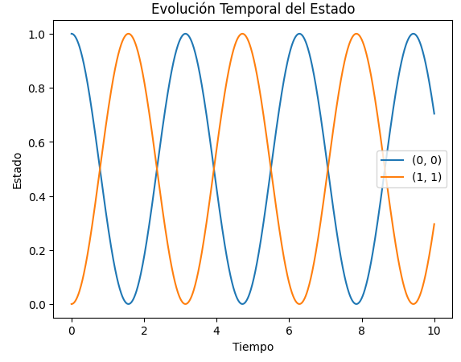

# Tutorial

En esta parte se centrará en un enfoque orientado al aprendizaje. Se aprenderá como comenzar con el código de este proyecto

# Introducción Rápida

En este tutorial, se aprenderá a utilizar el código para simular la evolución temporal de un sistema cuántico. Este proceso se realiza mediante el método numérico de Runge-Kutta de cuarto orden (RK4).

# Requisitos Previos

Antes de comenzar, asegúrate de tener instaladas las siguientes bibliotecas en tu entorno de Python:

```python
pip install numpy 
pip install matplotlib
```

## Paso 1: Configurar el Entorno

Primero, abrir el editor de código y crear un nuevo arhcivo Python.
Por ejemplo, llamarlo dynamics.py

## Paso 2: Importar Bibliotecas

Comenzar importando las bibliotecas que se utilizarán:

```python
import numpy as np
import matplotlib.pyplot as plt
```

## Paso 3: Se definen los estados iniciales y el operador cuántico

```python
# Estado inicial
yInit = np.array([[1, 0], [0,0]])

# Operador cuántico
oOper = np.array([[1, 0], [0, -1]])
```
## Paso 4: Implementar la función dinámica

Agregar la función que genera la dinámica de la evolución temporal del estado cuántico:

```python
def dyn_generator(oper, state):
  """Genera la dinámica de la evolución temporal del etado cuántico."""
  return -1.0j * (np.dot(oper, state)) - np.dot(state, oper))

## Paso 5: Implementar Runge-Kutta 4

```python
def rk4(func, oper, state, h):
    k1 = h * func(oper, state)
    k2 = h * func(oper, state + (0.5 * k1))
    k3 = h * func(oper, state + (0.5 * k2))
    k4 = h * func(oper, state + k3)
    return state + (1/6) * (k1 + 2*k2 + 2*k3 + k4)
```

## Paso 6: Parámetros del Tiempo

Configurar los parámetros de tiempo en la simulación:

```python
# Parámetros de tiempo
times = np.linspace(0.0, 10.0, 1000)
h = times[1] - times[0]
```

## Paso 7: Guardar resultados

Crear variables para almacenar los resultados de la evolución temporal:

```python
# Variables para guardar los resultados
stateQuant00 = np.zeros(times.size)
stateQuant11 = np.zeros(times.size)
```

## Paso 8: Correr la Simulación

Usar ciclos for para ejecutar la evolución temporal usando RK4:
# Evolución temporal usando el método RK4
for tt in range(times.size):
    stateQuant00[tt] = yInit[0, 0].real
    stateQuant11[tt] = yInit[1, 1].real
    yN = rk4(dyn_generator, oOper, yInit, h)
    yInit = yN

## Paso 9: Graficar Resultados

```python
plt.plot(times, stateQuant00, label='(0, 0)')
plt.plot(times, stateQuant11, label='(1, 1)')
plt.xlabel('Tiempo')
plt.ylabel('Estado')
plt.legend()
plt.title('Evolución Temporal del Estado Cuántico')
plt.show()
```

# Ejecutar el código
Guardar el archivo y ejecutarlo en la terminal:
```python
python dynamics.py
```

### Gráfica: 

